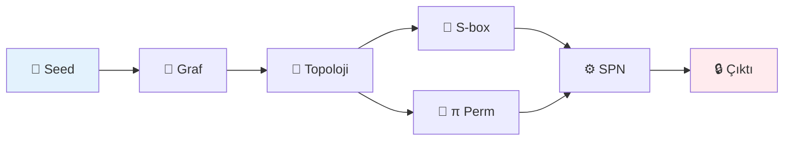

<![CDATA[<div align="center">

# 🔐 Graf Tabanlı Kriptografik Byte Üreteci


<br/><br/>

**Graf topolojisinden türetilen dinamik S-box ile AES seviyesinde güvenlik**

<br/>

```
Seed → Graf → Topoloji → S-box → SPN → Güvenli Byte
```

</div>

<br/>

---

<br/>

## ⚡ Hızlı Başlangıç

```python
from src.main import GraphCrypto

crypto = GraphCrypto("my_secret_seed")
secure_bytes = crypto.generate_bytes(32)
print(secure_bytes.hex())
```

<br/>

---

<br/>

## 🎯 Neden Bu Proje?

<table>
<tr>
<td width="50%">

### ❌ Geleneksel (AES)
```python
# Sabit S-box
S_BOX = [0x63, 0x7c, ...]  
# Herkes için aynı!
```

</td>
<td width="50%">

### ✅ Bizim Yaklaşım
```python
# Dinamik S-box
graph = build_graph(seed)
S_BOX = generate_sbox(graph)
# Her seed için benzersiz!
```

</td>
</tr>
</table>

<br/>

---

<br/>

## 📊 Sistem Mimarisi



<br/>

### Detaylı Akış

```
┌─────────────────────────────────────────────────────────────┐
│                                                             │
│   SEED ──▶ SHA512×48 ──▶ GRAF (256 node, ~1500 edge)       │
│                              │                              │
│              ┌───────────────┼───────────────┐              │
│              ▼               ▼               ▼              │
│           Degree        Clustering      Laplacian           │
│              │               │               │              │
│              └───────────────┴───────────────┘              │
│                              │                              │
│                         XOR Fusion                          │
│                              │                              │
│                    ┌─────────┴─────────┐                    │
│                    ▼                   ▼                    │
│                 S-box (π)          Round Keys               │
│                    │                   │                    │
│                    └─────────┬─────────┘                    │
│                              ▼                              │
│                     SPN (12 rounds)                         │
│                              │                              │
│                              ▼                              │
│                    16-byte Secure Block                     │
│                                                             │
└─────────────────────────────────────────────────────────────┘
```

<br/>

---

<br/>

## 🧮 Algoritma

<details>
<summary><strong>1️⃣ Graf Oluşturma</strong></summary>

<br/>

```
ALGORITHM BuildGraph(seed)
───────────────────────────
INPUT:  seed (string)
OUTPUT: G (256-node graph)

hash ← SHA512(seed)
FOR round = 0 TO 47:
    hash ← SHA512(hash || round)
    FOR i = 0 TO 31:
        u, v ← hash[2i], hash[2i+1]
        IF u ≠ v: G.add_edge(u, v)
RETURN G
```

</details>

<details>
<summary><strong>2️⃣ Topolojik Özellik Çıkarımı</strong></summary>

<br/>

```
ALGORITHM ExtractFeatures(G)
────────────────────────────
degree[i]     ← G.degree(i)
clustering[i] ← clustering_coefficient(i)
betweenness[i]← betweenness_centrality(i)
λ[]           ← eigenvalues(Laplacian(G))

topo_bytes ← degree ⊕ clustering ⊕ betweenness ⊕ λ
RETURN topo_bytes
```

</details>

<details>
<summary><strong>3️⃣ S-box Üretimi (Affine Mod)</strong></summary>

<br/>

```
ALGORITHM GenerateSbox(topo_bytes, λ)
─────────────────────────────────────
A ← AES_AFFINE_MATRIX (8×8)
b ← SHA256(topo_bytes)[0] ⊕ XOR(λ[0:8])

FOR x = 0 TO 255:
    S'[x] ← (A × S_AES[x]) ⊕ b

RETURN S'
```

**Neden Affine?**
- ✅ DU = 4 korunur
- ✅ NL = 112 korunur  
- ✅ Bijective garantili

</details>

<details>
<summary><strong>4️⃣ SPN Round</strong></summary>

<br/>

```
ALGORITHM EncryptBlock(counter, S, π, RK)
─────────────────────────────────────────
state ← counter
state ← state ⊕ RK[0]

FOR r = 1 TO 11:
    state ← SubBytes(state, S)
    state ← ShiftRows(state)
    state ← BitPermutation(state, π)
    state ← MixColumns(state)
    state ← state ⊕ RK[r]

// Final round (no MixColumns)
state ← SubBytes(state, S)
state ← ShiftRows(state)
state ← BitPermutation(state, π)
state ← state ⊕ RK[12]

RETURN state
```

</details>

<br/>

---

<br/>

## 💻 Kod Örnekleri

<details>
<summary><strong>Graf Oluşturma</strong></summary>

<br/>

```python
import hashlib
import networkx as nx

def build_graph(seed: str) -> nx.Graph:
    G = nx.Graph()
    G.add_nodes_from(range(256))
    
    h = seed.encode()
    for r in range(48):
        h = hashlib.sha512(h + bytes([r])).digest()
        for i in range(0, 64, 2):
            u, v = h[i], h[i+1]
            if u != v:
                G.add_edge(u, v)
    
    return G
```

</details>

<details>
<summary><strong>S-box Üretimi</strong></summary>

<br/>

```python
def generate_sbox_affine(topo_bytes, laplacian):
    # AES affine matrisi
    A = np.array([
        [1,0,0,0,1,1,1,1],
        [1,1,0,0,0,1,1,1],
        # ... (8x8 matrix)
    ])
    
    # b sabitini hesapla
    b = sha256(topo_bytes)[0]
    b ^= xor_reduce(normalize(laplacian[:8]))
    
    # S-box üret
    sbox = np.zeros(256, dtype=np.uint8)
    for x in range(256):
        sbox[x] = affine_transform(AES_SBOX[x], A, b)
    
    return sbox
```

</details>

<details>
<summary><strong>Tam Kullanım</strong></summary>

<br/>

```python
from src.main import GraphCrypto

# 1. Sistem oluştur
crypto = GraphCrypto("my_secret_seed")

# 2. Byte üret
block = crypto.generate_block()      # 16 byte
data = crypto.generate_bytes(1024)   # 1 KB

# 3. Şifrele
ciphertext = crypto.encrypt(b"Hello World!")

# 4. İstatistikler
print(crypto.get_stats())
```

**Çıktı:**
```
[OK] Sistem hazır!
     Graf: 256 node, 1491 edge
     S-box: AES'ten 248/256 byte farklı
```

</details>

<br/>

---

<br/>

## 📈 Güvenlik Metrikleri

### S-box Analizi

| Metrik | Değer | AES | Durum |
|:------:|:-----:|:---:|:-----:|
| **Differential Uniformity** | 4 | 4 | ✅ |
| **Nonlinearity** | 112 | 112 | ✅ |
| **SAC Score** | 0.9998 | 1.0 | ✅ |
| **BIC Score** | 1.0 | 1.0 | ✅ |

### Rastgelelik Testi (1000 blok)

| Metrik | Değer | Beklenen |
|:------:|:-----:|:--------:|
| **Bit Bias** | 0.04% | <1% ✅ |
| **Seri Korelasyon** | 0.0005 | <0.05 ✅ |
| **Unique Bytes** | 256/256 | 256 ✅ |

<br/>

---

<br/>

## 🔬 Pattern Analizi

### ✅ Neden Pattern Oluşmaz?

| Özellik | Açıklama |
|---------|----------|
| **Avalanche** | 1 bit değişim → %50 çıktı değişimi |
| **Periyot** | 2¹²⁸ (pratik olarak sonsuz) |
| **DDT Max** | 4 (optimal) |
| **LAT Max** | 16 (optimal) |

### Test Sonucu

```
Block 0: 46bea7d1 4d53bac6 5813d596 5c7bbbcd
Block 1: 62f9afa1 b2fd5dfb 72bf3798 6aeda3b7
Block 2: 51a59087 22028ef5 ca60a8c2 9ccda411

→ Görsel pattern yok ✅
→ İstatistiksel korelasyon yok ✅
```

<br/>

---

<br/>

## 📁 Proje Yapısı

```
Graph_based_cryptography/
│
├── src/
│   ├── main.py          # Ana sınıf
│   ├── topology.py      # Graf işlemleri
│   ├── sbox.py          # S-box üretimi
│   ├── spn.py           # SPN şifreleme
│   ├── gf256.py         # GF(2⁸) matematik
│   └── analysis.py      # Güvenlik testleri
│
├── demo.py              # Demo script
└── README.md
```

<br/>

---

<br/>

## 🚀 Kurulum

```bash
# Klonla
git clone https://github.com/user/Graph_based_cryptography.git
cd Graph_based_cryptography

# Bağımlılıklar
pip install networkx numpy

# Test
python demo.py
```

<br/>

---

<br/>

<div align="center">

## 🏆 Özet

| | |
|:---:|:---:|
| **Güvenlik** | AES-128 eşdeğeri |
| **Özgünlük** | Her seed → Benzersiz S-box |
| **Determinizm** | Tekrarlanabilir |
| **Pattern** | Oluşmaz |

<br/>

```
🔑 GraphCrypto(seed) = SPN₁₂(Counter, S(G(seed)), π(G), RK)
```

<br/>

**Made with ❤️ for cryptographic research**

</div>
]]>
