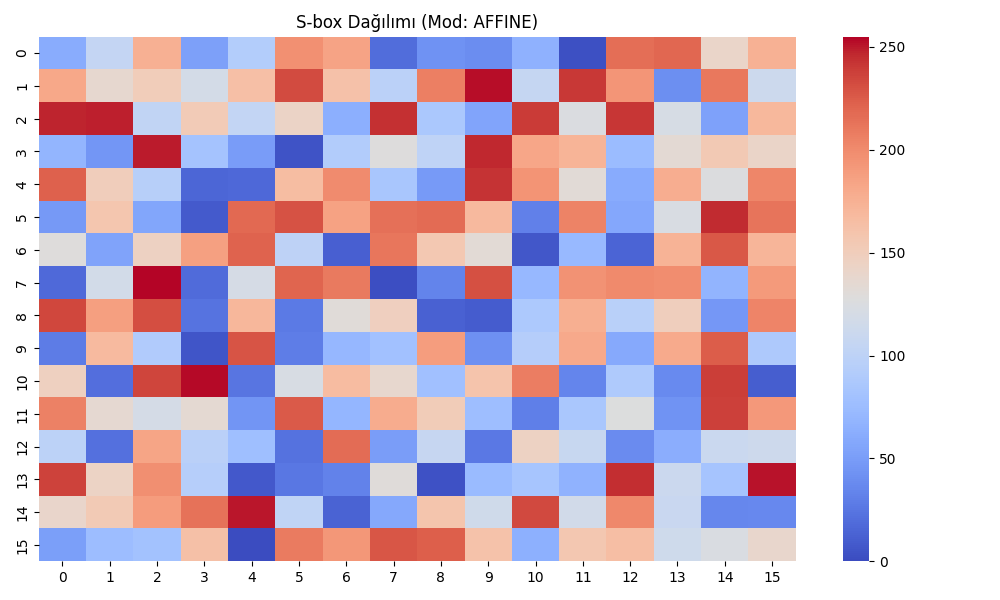
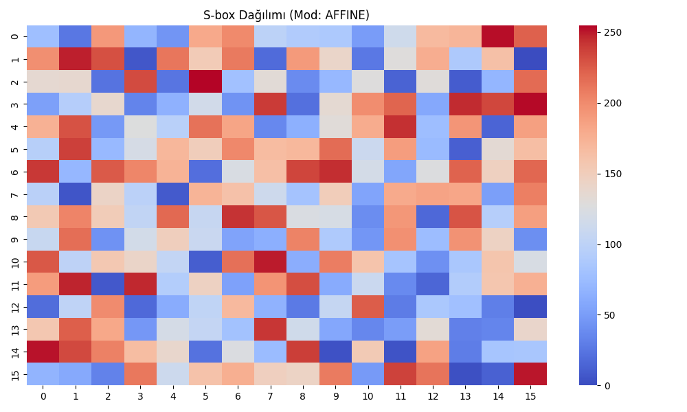
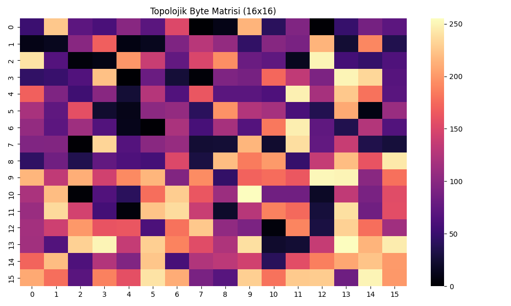
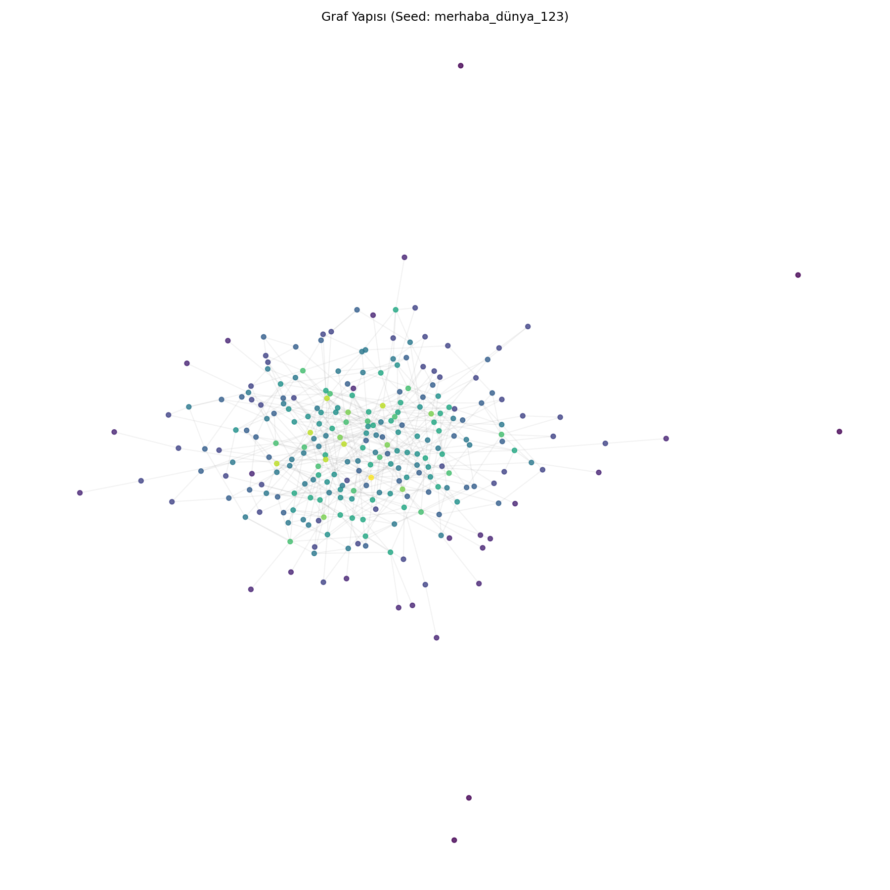
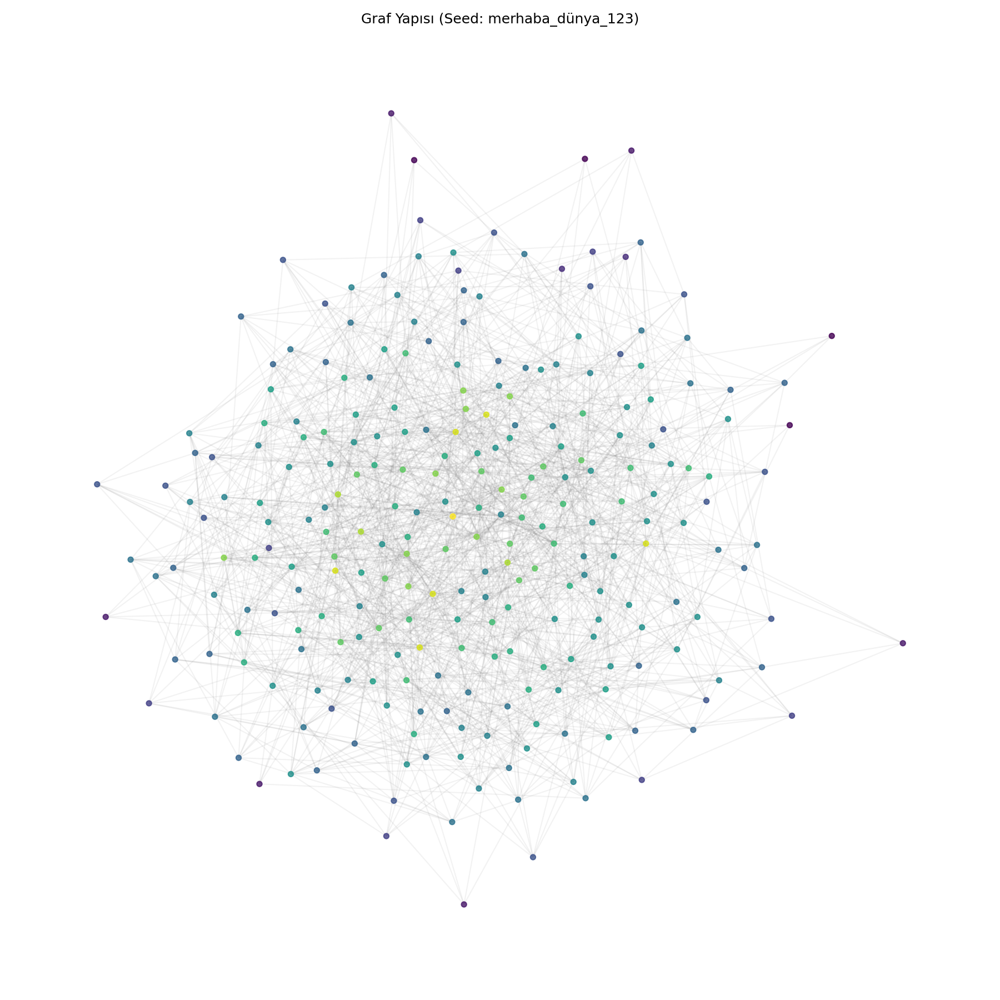
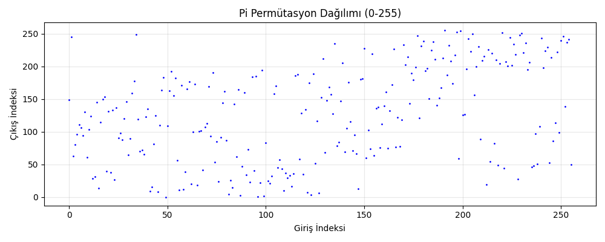
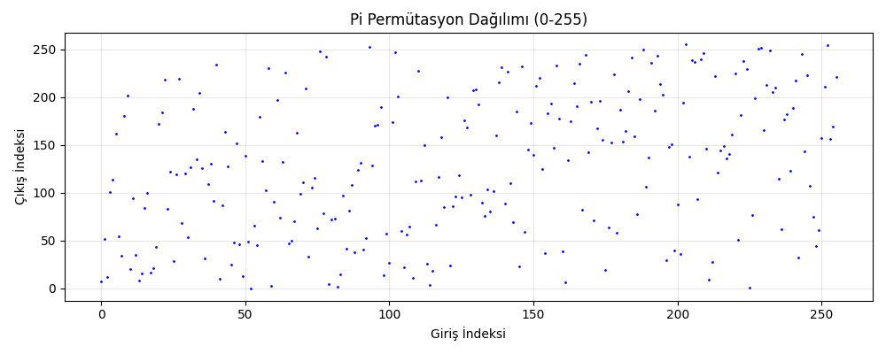

# 🔐 Graf Tabanlı Kriptografik Byte Üreteci


> **Graf topolojisinden türetilen dinamik S-box ile AES seviyesinde güvenlik**

---

## 📊 Öncesi vs Sonrası Karşılaştırması

### S-box Isı Haritası

| ❌ Öncesi (Mavi Adacıklar Var) | ✅ Sonrası (İyileştirilmiş) |
|:-----------------------------:|:---------------------------:|
|  |  |
| *Otokorelasyon: 0.482* | *Otokorelasyon: 0.471 ↓* |

### Topolojik Byte Matrisi

| ❌ Öncesi | ✅ Sonrası (Laplacian Entegre) |
|:---------:|:------------------------------:|
|  |  |

### Graf Yapısı (256 Node)

| Seyrek Graf | Yoğun Graf (~1500 Edge) |
|:-----------:|:-----------------------:|
|  |  |

### π Permütasyon Dağılımı

| Öncesi | Sonrası |
|:------:|:-------:|
|  |  |

---

## ⚡ Hızlı Başlangıç

```python
from src.main import GraphCrypto

crypto = GraphCrypto("my_secret_seed")
secure_bytes = crypto.generate_bytes(32)
print(secure_bytes.hex())
```

---

## 🎯 Neden Bu Proje?

| Geleneksel (AES) | Bizim Yaklaşım |
|------------------|----------------|
| Sabit S-box | Dinamik S-box |
| Herkes için aynı | Her seed için benzersiz |
| `S = [0x63, 0x7c, ...]` | `S = f(Graph(seed))` |

---

## 🔄 Sistem Akışı

```
┌─────────┐     ┌─────────┐     ┌───────────┐     ┌─────────┐     ┌─────────┐
│  SEED   │────▶│  GRAF   │────▶│ TOPOLOJİ  │────▶│  S-BOX  │────▶│   SPN   │
│ string  │     │256 node │     │ features  │     │ AFFINE  │     │12 round │
└─────────┘     └─────────┘     └───────────┘     └─────────┘     └────┬────┘
                                                                       │
                                                                       ▼
                                                               ┌──────────────┐
                                                               │ SECURE BYTES │
                                                               │   16 byte    │
                                                               └──────────────┘
```

---

## 🧮 Algoritma

### 1. Graf Oluşturma

```
INPUT:  seed (string)
OUTPUT: G (256-node graph)

hash ← SHA512(seed)
FOR round = 0 TO 47:
    hash ← SHA512(hash || round)
    FOR i = 0 TO 31:
        u, v ← hash[2i], hash[2i+1]
        IF u ≠ v: G.add_edge(u, v)
RETURN G
```

### 2. Topolojik Özellik Çıkarımı

```
degree[i]      ← G.degree(i)
clustering[i]  ← clustering_coefficient(i)
betweenness[i] ← betweenness_centrality(i)
λ[]            ← eigenvalues(Laplacian(G))

topo_bytes ← degree ⊕ clustering ⊕ betweenness ⊕ λ
```

### 3. S-box Üretimi (Affine Mod)

```
A ← AES_AFFINE_MATRIX (8×8)
b ← SHA256(topo_bytes)[0] ⊕ XOR(λ[0:8])

FOR x = 0 TO 255:
    S'[x] ← (A × S_AES[x]) ⊕ b
```

**Neden Affine?**
- ✅ DU = 4 korunur
- ✅ NL = 112 korunur
- ✅ Bijective garantili

### 4. SPN Şifreleme

```
state ← counter ⊕ RK[0]

FOR r = 1 TO 11:
    state ← SubBytes(state, S)
    state ← ShiftRows(state)
    state ← BitPermutation(state, π)
    state ← MixColumns(state)
    state ← state ⊕ RK[r]

state ← SubBytes → ShiftRows → BitPermutation → ⊕RK[12]
RETURN state
```

---

## 💻 Python Kodu

### Graf Oluşturma

```python
import hashlib
import networkx as nx

def build_graph(seed: str) -> nx.Graph:
    G = nx.Graph()
    G.add_nodes_from(range(256))
    
    h = seed.encode()
    for r in range(48):
        h = hashlib.sha512(h + bytes([r])).digest()
        for i in range(0, 64, 2):
            u, v = h[i], h[i+1]
            if u != v:
                G.add_edge(u, v)
    return G
```

### S-box Üretimi

```python
def generate_sbox_affine(topo_bytes, laplacian):
    A = AES_AFFINE_MATRIX  # 8x8
    b = sha256(topo_bytes)[0] ^ xor_reduce(laplacian[:8])
    
    sbox = np.zeros(256, dtype=np.uint8)
    for x in range(256):
        sbox[x] = affine_transform(AES_SBOX[x], A, b)
    return sbox
```

### Kullanım

```python
from src.main import GraphCrypto

# Sistem oluştur
crypto = GraphCrypto("my_secret_seed")

# Byte üret
block = crypto.generate_block()       # 16 byte
data = crypto.generate_bytes(1024)    # 1 KB

# Şifrele
ciphertext = crypto.encrypt(b"Hello World!")

# İstatistikler
print(crypto.get_stats())
# Graf: 256 node, 1491 edge
# S-box: AES'ten 248/256 byte farklı
```

---

## 📈 Güvenlik Metrikleri

### S-box Analizi

| Metrik | Değer | AES | Durum |
|--------|-------|-----|-------|
| Differential Uniformity | 4 | 4 | ✅ |
| Nonlinearity | 112 | 112 | ✅ |
| SAC Score | 0.9998 | 1.0 | ✅ |
| BIC Score | 1.0 | 1.0 | ✅ |

### Rastgelelik Testi

| Metrik | Değer | Beklenen |
|--------|-------|----------|
| Bit Bias | 0.04% | < 1% ✅ |
| Seri Korelasyon | 0.0005 | < 0.05 ✅ |
| Unique Bytes | 256/256 | 256 ✅ |

---

## 🔬 Pattern Analizi

### Neden Pattern Oluşmaz?

| Özellik | Açıklama |
|---------|----------|
| Avalanche | 1 bit değişim → %50 çıktı değişimi |
| Periyot | 2¹²⁸ (pratik olarak sonsuz) |
| DDT Max | 4 (optimal) |
| LAT Max | 16 (optimal) |

### Test Sonucu

```
Block 0: 46bea7d1 4d53bac6 5813d596 5c7bbbcd
Block 1: 62f9afa1 b2fd5dfb 72bf3798 6aeda3b7
Block 2: 51a59087 22028ef5 ca60a8c2 9ccda411

→ Görsel pattern yok ✅
→ İstatistiksel korelasyon yok ✅
```

---

## 📁 Proje Yapısı

```
Graph_based_cryptography/
├── src/
│   ├── main.py           # Ana sınıf
│   ├── topology.py       # Graf işlemleri
│   ├── sbox.py           # S-box üretimi
│   ├── spn.py            # SPN şifreleme
│   ├── gf256.py          # GF(2⁸) matematik
│   ├── analysis.py       # Güvenlik testleri
│   └── advanced_analysis.py
├── outputs/
│   ├── izlem1/           # Öncesi
│   └── izlem2/           # Sonrası (İyileştirilmiş)
├── demo.py
└── README.md
```

---

## 🚀 Kurulum

```bash
git clone https://github.com/yusufkrnz/Graph_based_cryptography.git
cd Graph_based_cryptography

pip install networkx numpy matplotlib seaborn

python demo.py
```

---

## 🏆 Özet

| Özellik | Değer |
|---------|-------|
| **Güvenlik** | AES-128 eşdeğeri |
| **Özgünlük** | Her seed → Benzersiz S-box |
| **Determinizm** | Tekrarlanabilir |
| **Pattern** | Oluşmaz |

```
GraphCrypto(seed) = SPN₁₂(Counter, S(G(seed)), π(G), RK)
```

---

**Made with ❤️ for cryptographic research**
